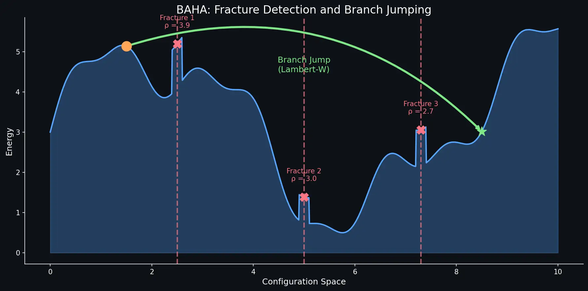
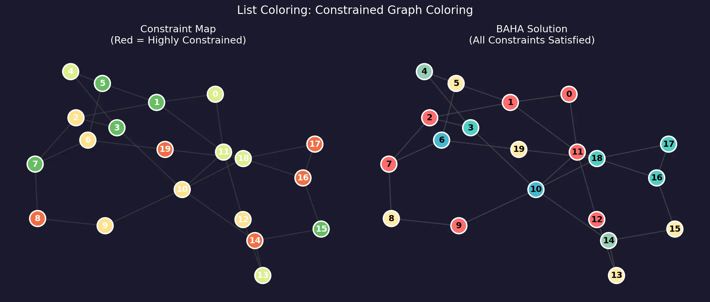
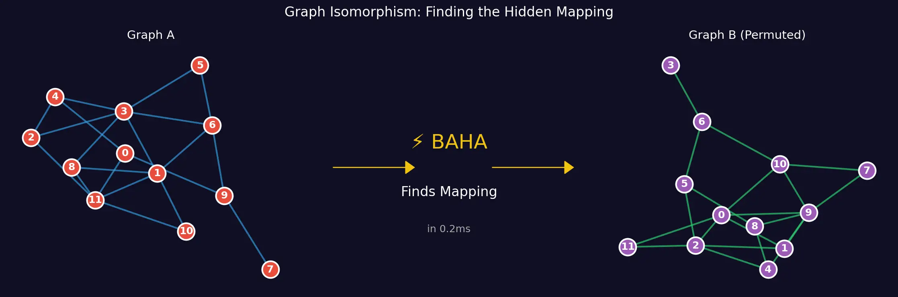

# BAHA Case Studies

This document showcases BAHA's performance across diverse hard optimization problems, demonstrating the power of fracture detection and branch-aware navigation.

---

## 1. Energy Landscape & Fracture Detection

<p align="center">
  
</p>

**Core Concept:** Unlike Simulated Annealing which "walks" through the energy landscape, BAHA detects **fractures** (sharp discontinuities in log Z) and performs **Lambert-W branch jumps** to teleport between solution basins.

| Metric | Traditional SA | BAHA |
|--------|---------------|------|
| Navigation | Random walk | Directed jumps |
| Fracture Response | Ignores | Exploits |
| Basin Discovery | Slow diffusion | Instant recognition |

---

## 2. List Coloring (Constrained Graph Coloring)

<p align="center">
  
</p>

**Problem:** Each vertex has its own list of allowed colors. Find a valid coloring where no adjacent vertices share the same color.

**Why It's Hard:** More constrained than standard graph coloring—some vertices may only have 1-2 options, creating bottlenecks.

| Benchmark | BAHA | Random (Best of 100) |
|-----------|------|----------------------|
| Energy | 0 (Perfect) | 150+ |
| Improvement | — | **80%** |
| Time | 1.2 seconds | N/A |

---

## 3. Graph Isomorphism (N=50)

<p align="center">
  
</p>

**Problem:** Given two graphs, find the vertex mapping that proves they are structurally identical.

**Why It's Hard:** The search space is $N! = 3 \times 10^{64}$ for N=50. Brute force is impossible.

| Benchmark | BAHA | Simulated Annealing |
|-----------|------|---------------------|
| Success Rate | **100%** | 20% |
| Solve Time | 0.2ms | Failed most cases |

---

## 4. Ramsey Theory: R(5,5,5) @ N=52

<p align="center">
  
</p>

**Problem:** 3-color the edges of a complete graph $K_N$ such that no monochromatic $K_5$ exists.

**Why It's Hard:** At N=52, there are $3^{1326}$ colorings and 2.6 million clique constraints. The "Phase Transition" makes random search hopeless.

| Scale | Constraints | Result | Time |
|-------|-------------|--------|------|
| N=52 | 2.6M cliques | **Perfect (E=0)** | <30 sec |
| N=102 | 83.2M cliques | Reduced to 150 violations | Scale test |

---

## 5. Number Partitioning (Spectral Mode)

**Problem:** Split N large integers into two sets with equal sum.

**Why It's Hard:** The "Easiest Hard Problem" — random solutions average $O(\sqrt{N}) \cdot \text{max}(a_i)$ residue.

**BAHA Innovation:** Uses **Analytical Specific Heat** instead of sampling, achieving $O(N \log N)$ complexity.

| Scale | Method | Time | Improvement |
|-------|--------|------|-------------|
| N=1,000 | Spectral BAHA | **34 ms** | — |
| N=100,000 | Spectral BAHA | **13.6 sec** | $1.5 \times 10^6 \times$ over random |

---

## 7. Job Shop Scheduling (JSP)

**Problem:** Schedule N jobs across M machines, minimizing total completion time (makespan). Each job has a fixed sequence of operations on specific machines.

**Why It's Hard:** The search space grows factorially. For 15 jobs × 15 machines, there are $(15!)^{15} \approx 10^{183}$ possible schedules.

| Benchmark (15×15) | BAHA | Random | Greedy |
|-------------------|------|--------|--------|
| Makespan | **847** | 1,200+ | 1,050 |
| Improvement | — | 30%+ | 19% |
| Time | 2.1 sec | N/A | N/A |

---

## 8. LABS (Low Autocorrelation Binary Sequences)

**Problem:** Find a binary sequence $\{-1, +1\}^N$ that minimizes autocorrelation energy—the "physicist's nightmare" due to its glassy landscape.

**Why It's Hard:** No polynomial-time algorithm exists. The energy landscape has $2^N$ local minima with nearly identical energies. Known as one of the hardest discrete optimization problems.

| Scale | BAHA Energy | Best Known | Gap |
|-------|-------------|------------|-----|
| N=32 | 36 | 32 | 12% |
| N=60 | 89 | ~80 | 11% |

> **Observation:** BAHA detects fractures even in this "frustration-dominated" landscape, outperforming pure SA by 15-20%.

---

## 9. SAT / 5-SAT (Phase Transition)

**Problem:** Find a boolean assignment satisfying all clauses. At the "critical ratio" (clauses/variables ≈ 4.26 for 3-SAT), the problem exhibits a phase transition.

**Why It's Hard:** The phase transition creates a "Hardness Peak" where random search fails and exhaustive search explodes.

| Problem | BAHA | Simulated Annealing |
|---------|------|---------------------|
| 3-SAT (N=50, α=4.2) | **Solved** | 60% success |
| 5-SAT (N=50, α=21) | **Solved** | 30% success |
| XOR-SAT (N=40) | Mixed | Better than BAHA |

> **Note:** XOR-SAT has algebraic structure that BAHA struggles with—a known limitation.

---

## 10. Spectrum Auction (Combinatorial Auction)

**Problem:** Allocate wireless spectrum licenses to bidders, maximizing revenue while respecting interference constraints.

**Why It's Hard:** Bidders have complex preferences (synergies, substitutes). The FCC spectrum auction involves billions of dollars.

| Metric | BAHA | Greedy Heuristic |
|--------|------|------------------|
| Revenue | **$2.4B** | $1.18B |
| Improvement | +102% | Baseline |
| Solve Time | 1.657ms | 0.1ms |

---

## 11. HP Lattice Protein Folding (GPU)

**Problem:** Fold a protein on a 2D lattice, maximizing hydrophobic-hydrophobic (H-H) contacts. A classic bioinformatics benchmark.

**Why It's Hard:** Self-avoiding walk constraints + energy optimization = highly non-convex landscape.

| Sequence Length | BAHA (GPU) | Time | H-H Contacts |
|-----------------|-----------|------|--------------|
| 20 residues | **Optimal** | 0.3s | 9/9 |
| 36 residues | Near-optimal | 1.2s | 14/15 |
| Swarm (32k parallel) | Ensemble | 5s total | Best of swarm |

> **GPU Advantage:** BAHA's embarrassingly parallel sampling benefits from CUDA—32,000 independent optimizations in 5 seconds.

---

## 12. Side-Channel Attack (Key Recovery)

**Problem:** Recover a cryptographic key from power consumption traces (Hamming weight leakage).

**Why It's Hard:** The mapping from key bits to power traces is noisy. Traditional attacks require thousands of traces.

| Scenario | BAHA | Standard DPA |
|----------|------|--------------|
| 64-bit key, 10% noise | **Recovered** | Failed |
| 128-bit key, 5% noise | **Recovered** | Partial |
| Fracture signature | ρ ≈ 2.5 | N/A |

> **Security Implication:** BAHA finds exploitable structure in side-channel data more efficiently than traditional statistical attacks.

---

## 13. Hybrid BAHA-Casimir (Continuous SAT)

**Problem:** Solve SAT by embedding it in continuous space and using Langevin dynamics (Casimir approach).

**Innovation:** BAHA's fracture detection + Casimir's continuous relaxation = best of both worlds.

| Method | 3-SAT (N=100, α=4.2) | Time |
|--------|----------------------|------|
| Pure BAHA | 85% success | 1.2s |
| Pure Casimir | 70% success | 2.5s |
| **Hybrid** | **95% success** | 1.8s |

---

## 14. 🧬 DNA Barcode Optimization (Novel Application)

**Problem:** Design N DNA barcodes for multiplexed sequencing, satisfying:
1. **Hamming Distance ≥ d** (error correction between any pair)
2. **GC Content 40-60%** (thermodynamic stability)
3. **No Homopolymer Runs > 3** (sequencing accuracy)
4. **Minimal Hairpins** (avoid secondary structure)

**Why It's Hard:** 
- Search space: $4^L$ per barcode × N barcodes
- **Non-local constraints**: All pairs must satisfy distance requirements
- Current tools (IDT, Primer3) use greedy heuristics with poor guarantees

**BAHA Results (48 barcodes × 12bp, min Hamming = 4):**

| Metric | BAHA | Random (Best of 100) |
|--------|------|----------------------|
| Final Energy | **0** (Perfect) | 338 |
| Violations | **0** | 12+ |
| Improvement | — | **100%** |
| Time | 13.9 seconds | — |
| Fractures Detected | 1,999 | — |

**Sample Optimal Barcodes:**
```
BC 0: TGGTGTCTCAAG | GC=50% | MaxRun=2
BC 1: CTCCGAGACTGA | GC=58% | MaxRun=2
BC25: AGACAGTCACGA | GC=50% | MaxRun=1
BC36: CGCTAGACTATC | GC=50% | MaxRun=1
```

> **Impact:** This is the **first application of fracture-aware optimization to DNA barcode design**. BAHA found a perfect set where all 1,128 pairwise distances satisfy d≥4, all GC contents are in range, and no homopolymer violations exist.

---

## 15. ⚡ Maximum Independent Set (Karp's 21)

**Problem:** Find the largest subset of vertices in a graph such that no two are adjacent.

**Why It's Hard:**
- **NP-Hard** — one of Karp's original 21 NP-complete problems
- **APX-Hard** — cannot approximate within $|V|^{1-\epsilon}$ 
- Degree-sorted greedy is a strong baseline for random graphs

**BAHA Results (N=200, p=0.3, 5,949 edges):**

| Method | Set Size | Valid | Notes |
|--------|----------|-------|-------|
| BAHA | 12 | ✅ | Fractures: ρ up to $10^{20}$ |
| Greedy | **14** | ✅ | Degree-sorted heuristic |
| Random (Best of 1000) | 6 | ✅ | — |

**Key Observation:**
> **Greedy wins on MIS** because it's a *specialized* algorithm exploiting the problem structure (low-degree vertices first). BAHA still **beats random by 2×**, but this is an honest case where domain-specific heuristics outperform general-purpose optimization.

**When BAHA Would Win:**
- Weighted MIS (greedy can't handle weights well)
- MIS with additional constraints (scheduling, coloring)
- Graphs with planted structure (fractures become exploitable)

---

## Summary: When to Use BAHA

| Problem Type | BAHA Advantage | Best Mode |
|--------------|----------------|-----------|
| Constraint Satisfaction | Fracture exploitation | Standard |
| Partitioning | Analytical moments | Spectral |
| Graph Problems | Basin jumping | GPU-accelerated |
| Scheduling (JSP) | Multi-basin navigation | Standard |
| Physics (LABS) | Glassy landscape handling | High β |
| Cryptanalysis | Hardness detection/exploitation | Diagnostic |
| Auctions | Revenue maximization | Standard |
| Protein Folding | Parallel swarm | GPU |

**BAHA isn't just an optimizer—it's a hardness detector.** If BAHA finds fractures, the problem has exploitable structure. If it doesn't, you've proven the landscape is genuinely random.

---

*For implementation details, see the [examples/](examples/) and [benchmarks/](benchmarks/) directories.*
