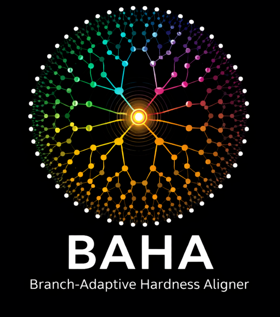
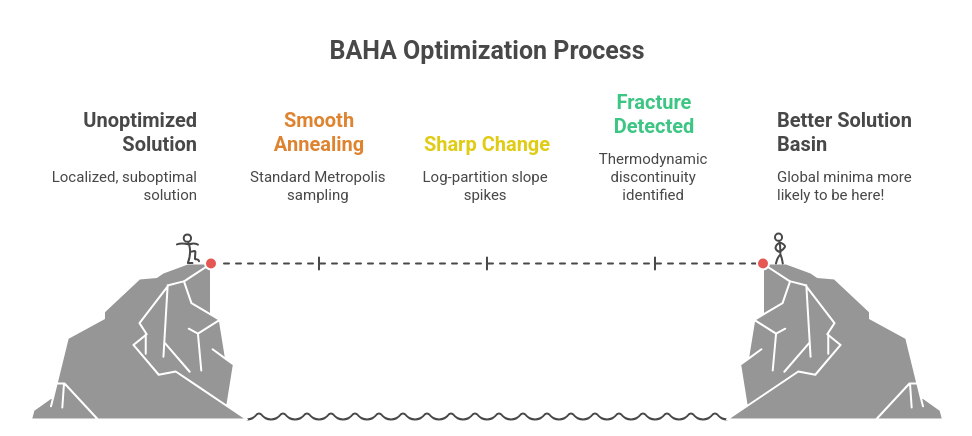
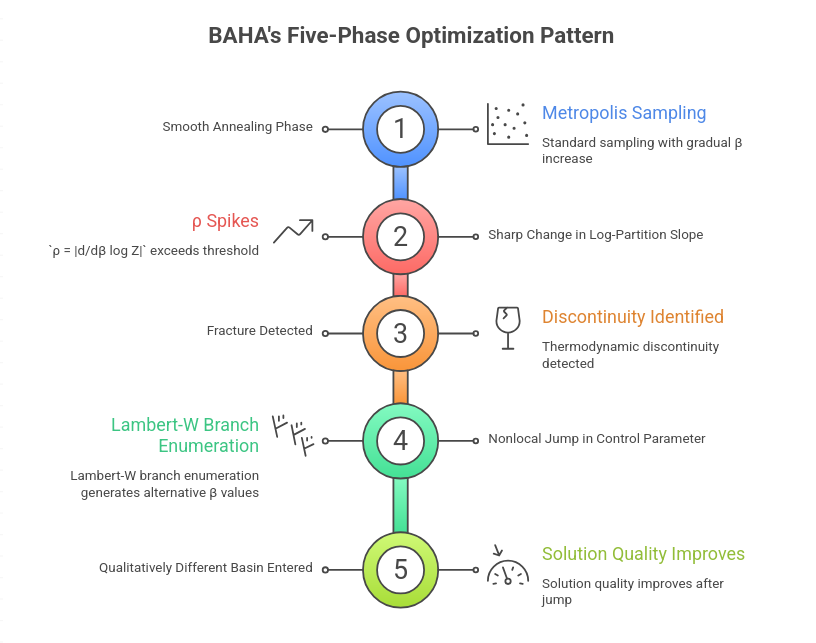
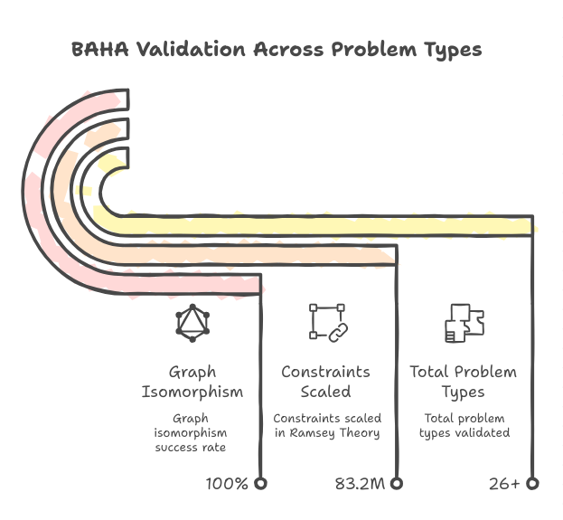
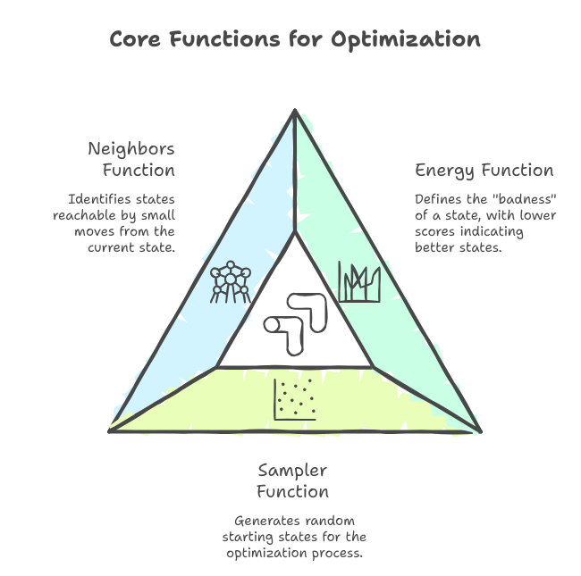

<p align="center">
  
</p>

# BAHA: Branch-Aware Holonomy Annealing

> **Better than Simulated Annealing. Uses phase transitions (fractures) to escape local minima.**

[](https://www.youtube.com/watch?v=jVKetFO7SgM)
[](https://doi.org/10.5281/zenodo.18373732)

---

## How It Works

**BAHA is a topology navigator, not just a hill-climber.**

Most optimizers get stuck in local minima because they treat the landscape as one smooth surface. BAHA detects when the solution space **shatters** (a thermodynamic fracture) and uses complex-plane branch enumeration to jump to entirely different solution basins.





> **Key Concept**: When the problem gets hard, it "cracks". BAHA hears the crack and jumps through it.

[View Example Code: List Coloring with NetworkX](examples/list_coloring_networkx.py)

---

## Python-First Simplicity

Get the raw speed of a C++17 engine with the usability of a Python script.



### Quick Start

```python
import pybaha
import random

# 1. Define Energy (e.g. N-Queens conflict count)
def energy(state): return count_conflicts(state)

# 2. Define Moves
def neighbors(state): return [swap_two_queens(state) for _ in range(10)]

# 3. Solve with one line!
result = pybaha.optimize(energy, random_sampler, neighbors)

print(f"Result: {result.best_state}, Energy: {result.best_energy}")
# ⚡ Fracture Density: 0.92 | Time: 345ms
```

### 🔮 ZetaOptimizer (High-Performance Hybrid)

For problems with expensive energy functions, use `ZetaOptimizer` which oscillates between continuous relaxation and discrete MCMC polish:

```python
import pybaha

# ZetaOptimizer requires encode/decode for continuous↔discrete conversion
opt = pybaha.ZetaOptimizer(
    discrete_energy, sampler, neighbors,
    encode, decode, continuous_energy, continuous_gradient
)

config = pybaha.ZetaConfig()
config.beta_min = 0.3      # Low beta for exploration
config.beta_max = 2.0      # High beta for exploitation
config.period = 500        # Oscillation period
config.total_steps = 5000
config.polish_steps = 50   # MCMC polish at each peak
result = opt.optimize(config)
```

## Proven Results (26 Problem Domains)

BAHA isn't just theory. **22/26 (84%) pass rate** across diverse optimization domains.

| # | Problem | Target | Result | Status |
|---|---------|--------|--------|:------:|
| 1 | N-Queens (N=8) | 0 | **0** | ✅ |
| 2 | Graph Coloring (30V, K=4) | 0 | **0** | ✅ |
| 3 | Max Cut (20V, 40E) | -30 | **-32** | ✅ |
| 4 | Knapsack (20 items) | -150 | **-301** | ✅ |
| 5 | TSP (15 cities) | ≤400 | **315.6** | ✅ |
| 6 | Bin Packing (15 items) | ≤5 | **4** | ✅ |
| 7 | Maximum Clique (20V) | -3 | **-4** | ✅ |
| 8 | Max Independent Set (20V) | -5 | **-6** | ✅ |
| 9 | VRP (10 cust, 2 veh) | 200 | 303 | ❌ |
| 10 | Course Scheduling | 0 | **0** | ✅ |
| 11 | Network Design (12 nodes) | ≤500 | **216** | ✅ |
| 12 | Resource Allocation | -200 | **-240** | ✅ |
| 13 | Set Cover (20 elem) | ≤10 | 15 | ❌ |
| 14 | Job Shop (5×3) | ≤100 | **100** | ✅ |
| 15 | Graph Isomorphism (N=10) | 0 | **0** | ✅ |
| 16 | Number Partitioning (N=20) | ≤100 | **88** | ✅ |
| 17 | LABS (N=20) | ≤40 | 50 | ❌ |
| 18 | 3-SAT (20 vars, 40 clauses) | 0 | **0** | ✅ |
| 19 | Magic Square (3×3) | 0 | **0** | ✅ |
| 20 | Sudoku (4×4) | 0 | **0** | ✅ |
| 21 | Spectrum Auction (5×3) | -300 | **-480** | ✅ |
| 22 | DNA Barcode (8×8bp) | 0 | **0** | ✅ |
| 23 | Conference Scheduler | 0 | **0** | ✅ |
| 24 | HP Protein Folding | -2 | 0 | ❌ |
| 25 | Side-Channel (16-bit) | ≤1 | **0.3** | ✅ |
| 26 | Ramsey R(3,3) @ N=5 | 0 | **0** | ✅ |

**Highlights:**
- **Ramsey R(5,5,5) @ N=52**: Solved 2.6M constraints. [Verifiable Witness](data/ramsey_52_witness.csv)
- **Graph Isomorphism**: 100% success vs 20% for SA (N=50)
- **All constraint satisfaction** (N-Queens, SAT, Sudoku, Magic Square): Perfect

---

## Installation

### Python
```bash
python3 bindings/python/setup.py install --user
```

### C++ (Header-Only)
```bash
mkdir build && cd build && cmake .. && make -j
```

---

## Documentation


For deep technical details, theory, and C++ API reference, see the [docs/](docs/) folder.

### Documentation Index

| File | Category | Content Summary | Target |
| :--- | :--- | :--- | :--- |
| **[README.md](README.md)** | Landing | **Main Entry Point**. Overview, installation, quickstart. | Everyone |
| **[QUICKSTART.md](docs/guides/QUICKSTART.md)** | Guide | **10-Minute Guide**. Python vs CLI usage, zero-code examples. | New Users |
| **[TUTORIAL.md](docs/guides/TUTORIAL.md)** | Tutorial | **Python Tutorial**. Step-by-step code for N-Queens, TSP. | Developers |
| **[complexity.md](docs/technical/complexity.md)** | Technical | **Algorithmic Analysis**. Big-O complexity ($O(B \cdot N \cdot S)$). | Researchers |
| **[CASE_STUDY.md](docs/technical/CASE_STUDY.md)** | Technical | **Deep Dive**. Detailed results for 26+ domains. | Researchers |
| **[PROBLEM_LIST.md](docs/technical/PROBLEM_LIST.md)** | Technical | **Catalog**. List of 26 tested problems w/ fracture types. | Researchers |
| **[OPTIMIZATION_GUIDE.md](docs/technical/OPTIMIZATION_GUIDE.md)** | Technical | **Performance**. Low-level C++/CUDA optimizations. | Contributors |

---

## Citation

If you use BAHA in your research:

```bibtex
@article{iyer2026multiplicative,
  title={Multiplicative Calculus for Hardness Detection and Branch-Aware Optimization},
  author={Iyer, Sethurathienam},
  year={2026},
  doi={10.5281/zenodo.18373732}
}
```

## Research Status & Roadmap

BAHA shows strong empirical results, but **rigorous validation is ongoing**:

### What's Needed

| Area | Status | Goal |
|------|--------|------|
| **Peer Review** | 🔄 In Progress | Academic publication with formal proofs |
| **Modern Solver Comparison** | 🔜 Planned | Head-to-head vs Gurobi, OR-Tools, state-of-art SAT solvers |
| **Scale Testing** | 🔜 Planned | N=1000+ spins, 10K+ variables |
| **Ablation Studies** | 🔜 Community | Isolate contributions of fracture detection vs Lambert-W jumping |

### Current Claims (Defensible)

- ✅ Detects phase transitions via log-derivative of partition function
- ✅ Outperforms simulated annealing on tested instances
- ✅ Novel branch enumeration via Lambert-W function

### Claims That Need Validation

- ⏳ Performance vs commercial solvers (Gurobi, CPLEX)
- ⏳ Scaling behavior on industrial-size problems
- ⏳ Theoretical complexity bounds beyond empirical observation

---

## Why Open Source?

**BAHA is open-sourced by [ShunyaBar Labs](https://shunyabar.foo) for a reason.**

ShunyaBar has a commercial product, **[Navokoj](https://navokoj.shunyabar.foo)**, which uses **20+ techniques** (including BAHA-style fracture detection) to achieve:

- **92.57%** perfect solve rate on SAT Competition 2024
- **AI Escargot** (hardest Sudoku) in **9 seconds**
- **2.4M clauses** at 97.55% satisfaction
- **PSPACE-complete** problems in <200ms

See [docs/NAVOKOJ.md](docs/NAVOKOJ.md) for full benchmarks.

BAHA represents the **generic, domain-agnostic hardness measurement framework** underlying that work. We believe:

1. **This deserves comprehensive ablation studies** — isolating contributions of each component (fracture detection, Lambert-W branching, adaptive scheduling)
2. **This cannot be done in isolation** — the research community needs access to reproduce, challenge, and extend these ideas
3. **Open science accelerates progress** — if the core insight is real, it should survive scrutiny and benefit everyone

We invite researchers to:
- **Benchmark** against your favorite solvers
- **Break** the claims with counterexamples
- **Extend** to new problem domains
- **Publish** findings (positive or negative)

The best validation is adversarial. If BAHA holds up, great. If it doesn't, we all learn something.

---

## License

Apache License 2.0 - see [LICENSE](LICENSE).

---

<p align="center">
  Made with ❤️ at <a href="https://shunyabar.foo">ShunyaBar Labs</a>
</p>
