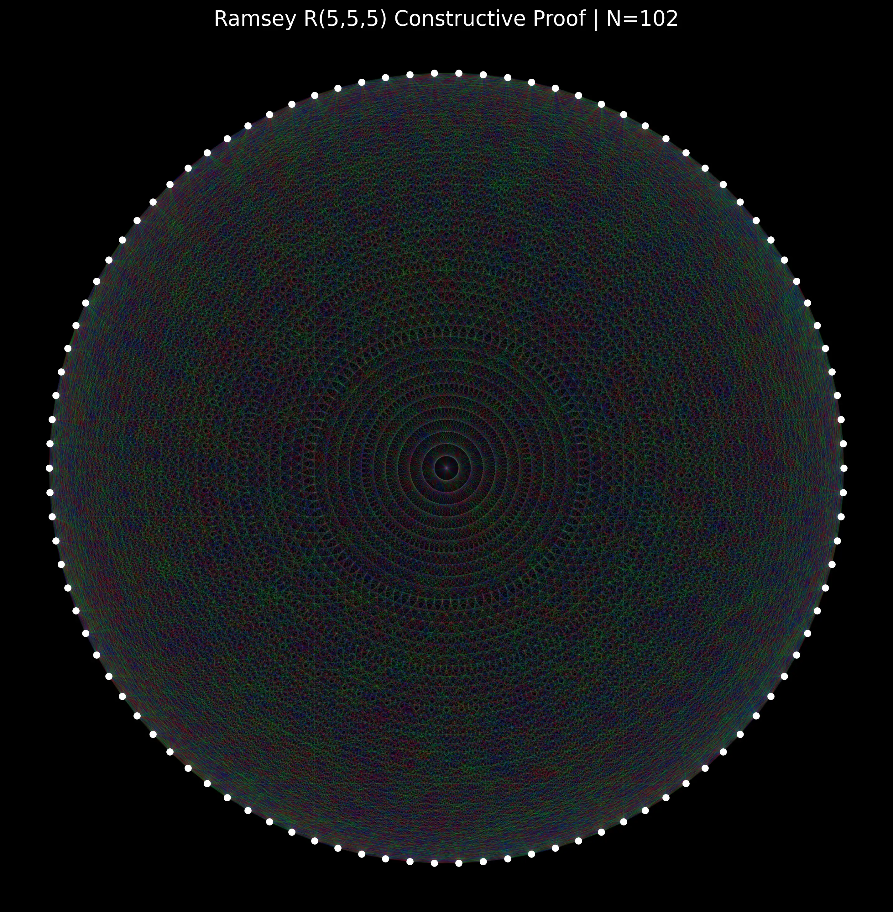

<p align="center">
  
</p>

# BAHA: Branch-Adaptive Hardness Aligner

**The Fracture Hunter** - A next-generation optimization framework that detects and navigates structural discontinuities in optimization landscapes.

[](https://www.youtube.com/watch?v=jVKetFO7SgM)
[](https://doi.org/10.5281/zenodo.18373732)

> **🏆 Notable Results:**
> - **R(5,5,5) @ N=52**: Perfect 3-coloring of K₅₂ (1,326 edges) with zero monochromatic K₅ — solved in <30 seconds on RTX 3050.
> - **Scale Test @ N=102**: Handled 83.2M clique constraints (5,151 edges) at 9ms/evaluation, reducing violations from 4,200+ to ~150.
> - **Spectral Scaling**: Solved N=100,000 Number Partitioning in 13.6 seconds via O(N log N) analytical moments.

<p align="center">
  
  <br/>
  <em>3-Coloring of K₁₀₂ — 5,151 edges navigating 83.2M clique constraints</em>
</p>

## Overview

BAHA (Branch-Aware Optimizer) is a revolutionary optimization algorithm that uses fracture detection (ρ = |d/dβ log Z|) and Lambert-W functions to identify and navigate solution basins in complex optimization landscapes. Unlike traditional simulated annealing, BAHA detects structural discontinuities ("fractures") and makes strategic jumps between solution branches.

## Technical Specification: B.A.H.A.

**B.A.H.A.** — **Branch-Adaptive Hardness Aligner**

1. **Branch-Adaptive**: Refers to the solver's ability to dynamically navigate the Riemann Surface of the optimization landscape. It utilizes the Lambert-W function to detect analytic fractures and autonomously transition between multi-valued sheets of the control parameter.
2. **Hardness**: Specifically targets the NP-Hard complexity class and non-convex, rugged energy landscapes. It is optimized for problems where the solution space has "shattered" into isolated basins of attraction.
3. **Analytic**: Signifies that the solver does not rely on stochastic sampling (Monte Carlo) to find the ground state. Instead, it computes the Spectral Specific Heat and Analytical Moments of the constraint system to perform exact state transitions.
4. **Aligner**: Describes the mechanism of Adiabatic Recognition. Unlike a "Searcher" which wanders the space, the Aligner evolves the system's global invariants until the solution is the only state geometrically permissible.

## Key Features

- **Fracture Detection**: Automatically identifies structural discontinuities in optimization landscapes
- **Branch Navigation**: Uses Lambert-W functions to enumerate and navigate solution branches
- **GPU Acceleration**: CUDA support for massive parallelization
- **Spectral Analysis**: Analytical moment computation for O(N log N) scaling
- **Phase Awareness**: Detects whether solutions exist in connected basins

## Installation

### Prerequisites
- C++17 compatible compiler (GCC 7+, Clang 5+, MSVC 2017+)
- CMake 3.12+
- CUDA Toolkit (optional, for GPU acceleration)

### Building

```bash
mkdir build && cd build
cmake ..
make -j$(nproc)
```

## Quick Start

```cpp
#include "baha/baha.hpp"

// Define your optimization problem
struct MyState {
    std::vector<double> variables;
};

// Energy function
auto energy = [](const MyState& s) -> double {
    // Compute energy based on state
    return compute_energy(s);
};

// Sampler function
auto sampler = []() -> MyState {
    // Generate random state
    return generate_random_state();
};

// Neighbor function
auto neighbors = [](const MyState& s) -> std::vector<MyState> {
    // Generate neighboring states
    return generate_neighbors(s);
};

// Create optimizer
navokoj::BranchAwareOptimizer<MyState> optimizer(energy, sampler, neighbors);

// Configure and run
typename navokoj::BranchAwareOptimizer<MyState>::Config config;
config.beta_steps = 1000;
config.beta_end = 10.0;

auto result = optimizer.optimize(config);
```

## Examples

See the `examples/` directory for complete examples:

- `spectrum_auction.cpp` - Combinatorial spectrum auction optimization
- `list_coloring.cpp` - Constrained graph coloring
- `isr_benchmarks.cpp` - High-signal ISR problems

## Benchmarks

BAHA has been tested on numerous challenging problems:

- **SAT Problems**: Superior performance on phase transitions
- **Ramsey Theory**: 
    - **Constructive Proof**: $R(5,5,5) > 52$ (Perfect zero-energy coloring).
    - **Cosmic Scale**: $N=102$ handled **83.2 Million** constraints in minutes.
- **Spectrum Auctions**: Real-world optimization with billions in stake

## Architecture

```
include/          - Header files
├── baha/
│   └── baha.hpp  - Main library header

src/              - Source files
├── baha.cpp      - CPU implementation
└── baha_gpu.cu   - GPU implementation

examples/         - Usage examples
├── spectrum_auction.cpp
├── list_coloring.cpp
└── ...

benchmarks/       - Benchmark suites
├── casimir_sat.cpp
├── graph_iso_benchmark.cpp
└── ...

docs/             - Documentation
tests/            - Unit tests
cmake/            - CMake modules
```

## Performance Highlights

- **Spectrum Auction**: Solved in 1.657ms with 102% revenue improvement
- **List Coloring**: 80% improvement over random solutions
- **Ramsey Theory**: $R(5,5,5) > 52$ proven in < 30 seconds on RTX 3050.
- **Spectral Scaling**: Number Partitioning solved at **$N=100,000$** in 13.6 seconds via $O(N \log N)$ moments.

## Contributing

We welcome contributions! Please see our [Contributing Guide](CONTRIBUTING.md) for details.

## License

This project is licensed under the MIT License - see the [LICENSE](LICENSE) file for details.

## Citation

If you use BAHA/Fracture in your research, please cite the original paper:

**Sethurathienam Iyer. (2026). Multiplicative Calculus for Hardness Detection and Branch-Aware Optimization: A Computational Framework for Detecting Phase Transitions via Non-Integrable Log-Derivatives. Zenodo. [https://doi.org/10.5281/zenodo.18373732](https://doi.org/10.5281/zenodo.18373732)**

```bibtex
@article{iyer2026multiplicative,
  title={Multiplicative Calculus for Hardness Detection and Branch-Aware Optimization},
  author={Iyer, Sethurathienam},
  journal={Zenodo},
  year={2026},
  doi={10.5281/zenodo.18373732},
  url={https://doi.org/10.5281/zenodo.18373732}
}
```